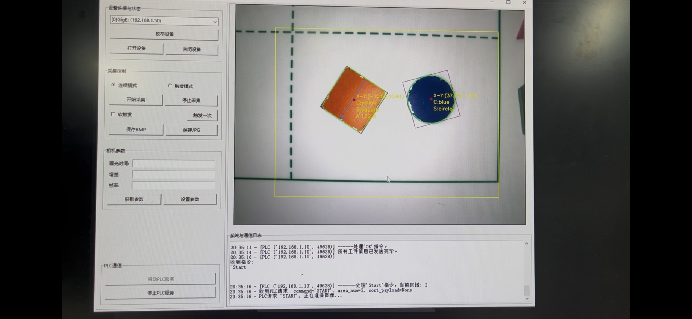
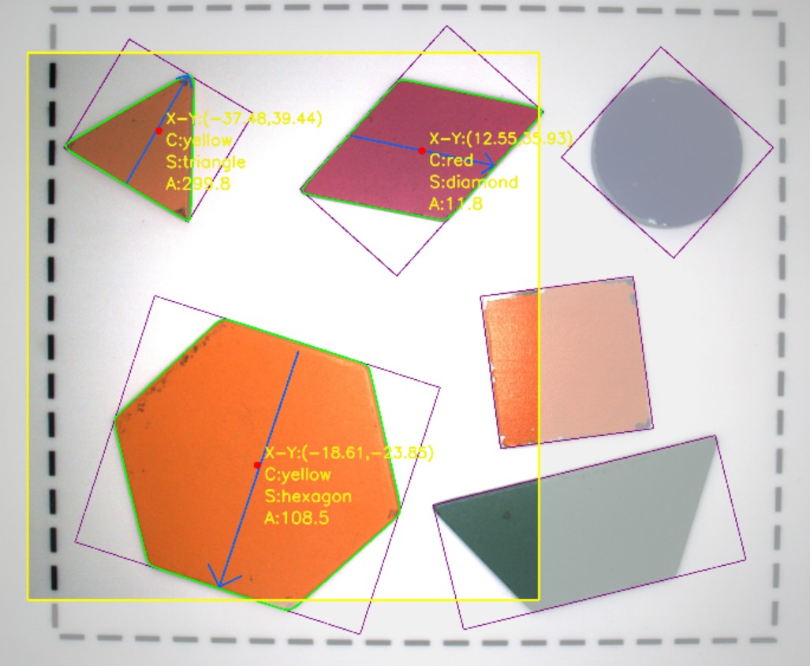
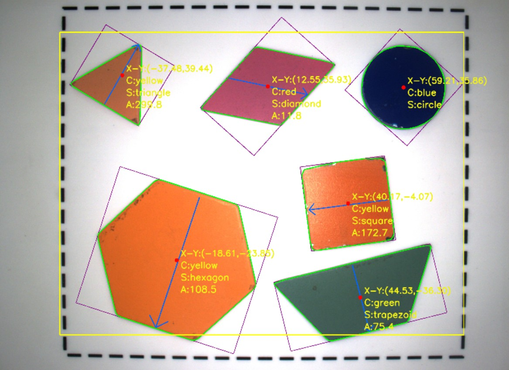

# MVision - 工业视觉检测与PLC通信系统


## 📖 项目介绍

MVision 是一个基于 Python 的工业视觉检测系统，集成了海康威视工业相机采集、图像处理和 PLC 通信功能，可用于自动化产线的工件识别与分拣。

### ✨ 主要功能

- 🎯 **工件形状识别** - 支持方形、圆形、三角形、梯形、六边形等多种形状
- 🎨 **多颜色检测** - 基于 HSV 色彩空间，支持红、黄、绿、蓝色检测
- 📍 **位置与角度计算** - 精确获取工件中心坐标和旋转角度
- 🔗 **PLC 通信** - TCP/IP 协议双向通信，实时发送检测结果
- 🖥️ **图形操作界面** - Tkinter GUI，直观控制相机和查看状态

---

## 📸 系统截图

### 软件界面



### 图像处理效果



### 检测结果



---

## 🛠️ 环境要求

### 硬件要求

| 设备     | 说明                          |
| -------- | ----------------------------- |
| 工业相机 | 海康威视 GigE 或 USB3 相机    |
| PLC      | 支持 TCP 通信的 PLC 设备      |
| 计算机   | Windows 10/11，推荐 8GB+ 内存 |

### 软件要求

1. **Python 3.8+**
2. **海康威视 MVS 软件**（必须）
   - 下载地址：[MVS 官网](https://www.hikrobotics.com/cn/machinevision/service/download?module=0)
   - 安装后会自动配置 SDK 环境变量

---

## 📦 安装步骤

### 1. 克隆仓库

```bash
git clone https://github.com/ForganY/MVision.git
cd MVision
```

### 2. 创建虚拟环境

```bash
python -m venv .venv

# Windows 激活
.venv\Scripts\activate

# Linux/MacOS 激活
source .venv/bin/activate
```

### 3. 安装依赖

```bash
pip install -r requirements.txt -i https://pypi.tuna.tsinghua.edu.cn/simple
```

---

## 🚀 使用方法

### 启动程序

```bash
cd src
python main.py
```

### 操作步骤

1. 点击 **枚举设备** 扫描连接的相机
2. 从下拉列表选择相机后点击 **打开设备**
3. 点击 **开始采集** 开始实时视频流
4. 点击 **启动 PLC 服务** 开始监听 PLC 通信
5. PLC 发送 `Start` 指令后，系统自动进行图像处理并返回结果

---

## ⚙️ 配置说明

### 主配置文件：`config/param.py`

| 参数                      | 说明         | 默认值                                   |
| ------------------------- | ------------ | ---------------------------------------- |
| `PLC_SERVER_HOST`       | TCP 监听地址 | `0.0.0.0`                              |
| `PLC_SERVER_PORT`       | TCP 端口     | `2000`                                 |
| `CALIBRATION_FILE_PATH` | 标定矩阵文件 | `assets/calibration/affine_matrix.txt` |
| `SCAN_AREA_FILES`       | 扫描区域配置 | 见配置文件                               |
| `hsv_range`             | HSV 颜色阈值 | 见配置文件                               |

### 扫描区域配置

编辑 `config/scan_areas/` 目录下的 `area_A.txt` 至 `area_D.txt`，格式：

```
x1 y1    # 左上角坐标
x2 y2    # 右下角坐标
```

---

## 📁 项目结构

```
MVision/
├── src/                     # 源代码
│   ├── main.py              # 程序入口
│   ├── ui.py                # GUI 界面
│   ├── tcp.py               # TCP 通信
│   ├── processimg.py        # 图像处理
│   ├── process_math.py      # 数学计算
│   ├── camera.py            # 相机参数
│   └── cam_operation.py     # 相机操作封装
├── lib/                     # 第三方库
│   └── MvImport/            # 海康 SDK 接口
├── config/                  # 配置文件
│   ├── param.py             # 主配置
│   └── scan_areas/          # 扫描区域配置
├── assets/                  # 资源文件
│   ├── images/              # 文档图片
│   └── calibration/         # 标定文件
├── .gitignore
├── README.md
└── requirements.txt
```

---

## 📡 PLC 通信协议

### 接收指令

| 指令      | 说明                       |
| --------- | -------------------------- |
| `Start` | 触发图像采集和处理         |
| `OK`    | 确认继续发送下一个工件信息 |
| `Stop`  | 停止当前操作               |

### 发送数据格式

```
0xS,+XXX.XX,+YYY.YY,-AAA.AA,C
```

| 字段        | 说明                              |
| ----------- | --------------------------------- |
| `+XXX.XX` | X 坐标（机器人坐标系）            |
| `+YYY.YY` | Y 坐标（机器人坐标系）            |
| `-AAA.AA` | 旋转角度                          |
| `C`       | 颜色代码 (Y=黄, R=红, G=绿, B=蓝) |

---
